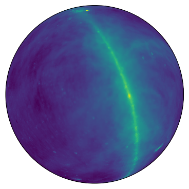
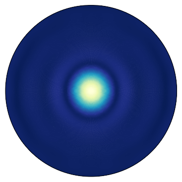
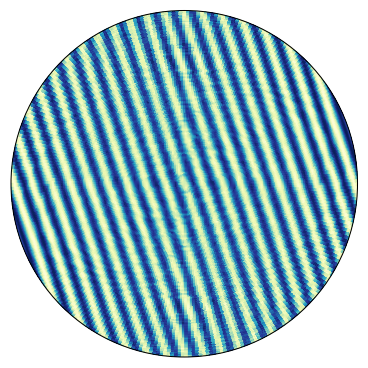

## vis_sim : Radio Interferometric Visibility Simulator

 +  +  = 

### Version: 0.1
Code Repo : https://github.com/nkern/vis_sim


### About:
`vis_sim` is a Python code for simulating a radio interferometer visibility by numerical evaluation of the [Measurement Equation](https://casper.berkeley.edu/astrobaki/index.php/Measurement_Equation).


### Code Dependencies:
- [healpy](https://github.com/healpy/healpy)
- [ephem](http://rhodesmill.org/pyephem/)
- [pyuvdata](https://github.com/HERA-Team/pyuvdata)
- [aipy](https://github.com/HERA-Team/aipy)
- [hera_cal](https://github.com/HERA-Team/hera_cal)
- [matplotlib.Basemap](https://matplotlib.org/basemap/)
- [astropy](http://www.astropy.org/)
- [scipy](https://www.scipy.org/)

### Installation:
Clone this directory and run the setup script as
```bash
python setup.py install
```

### Running:
See the `examples/` directory for tutorials on how to run the simulator.

### Author:
Nick Kern
